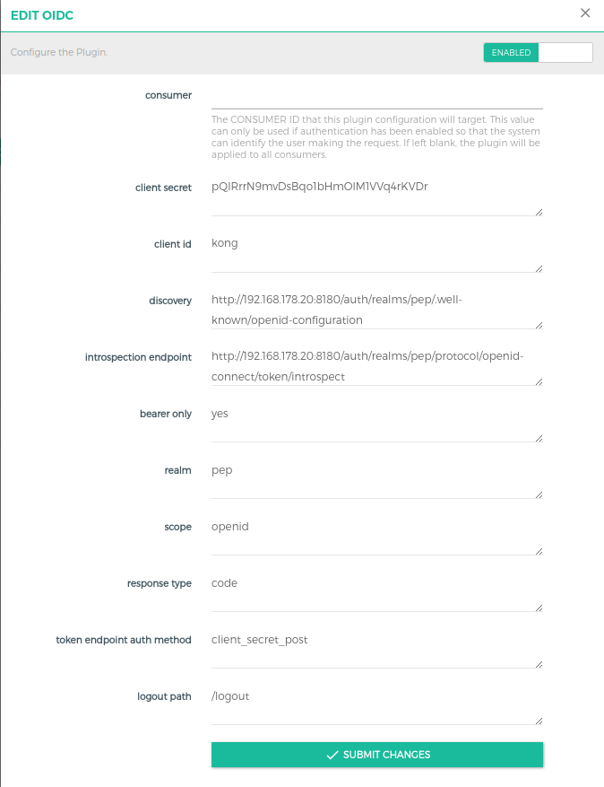
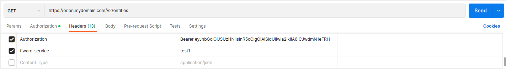
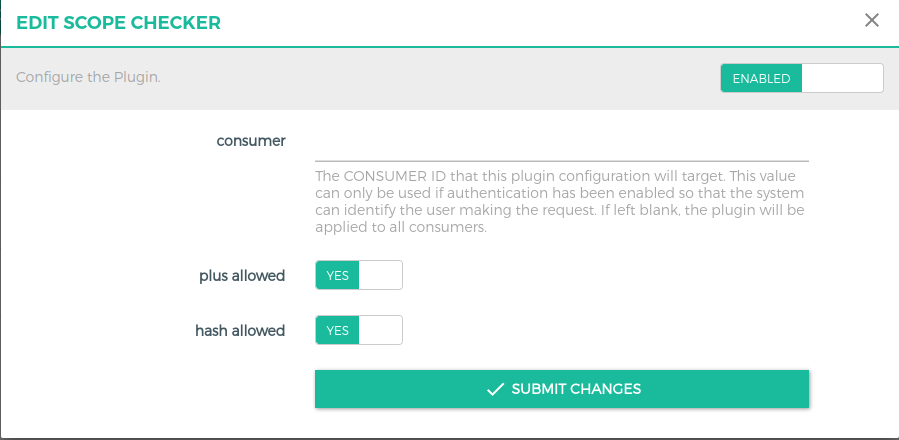
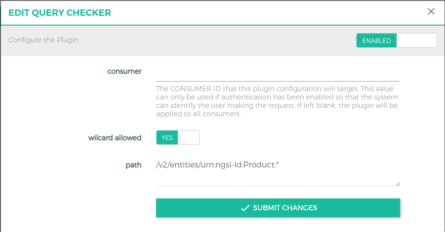
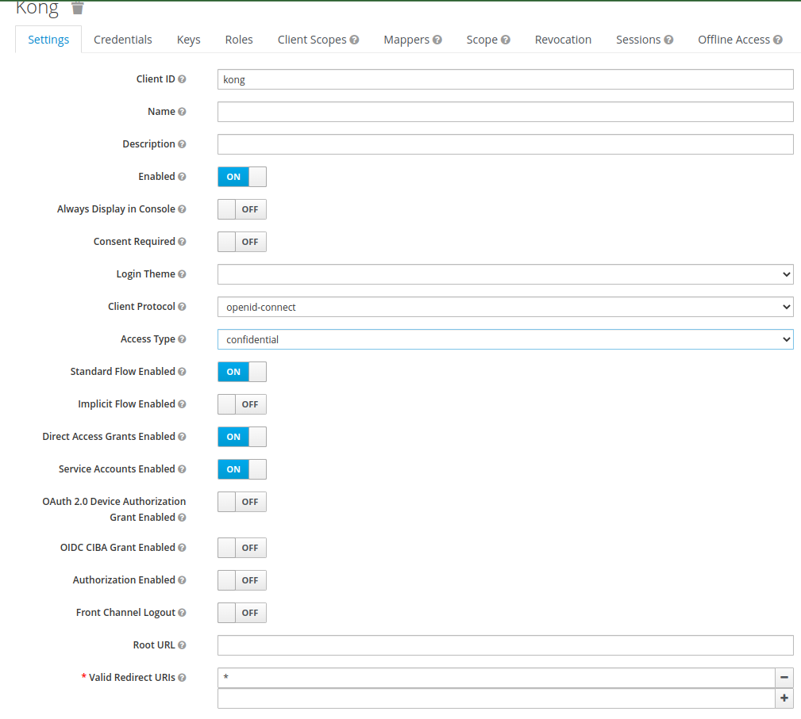
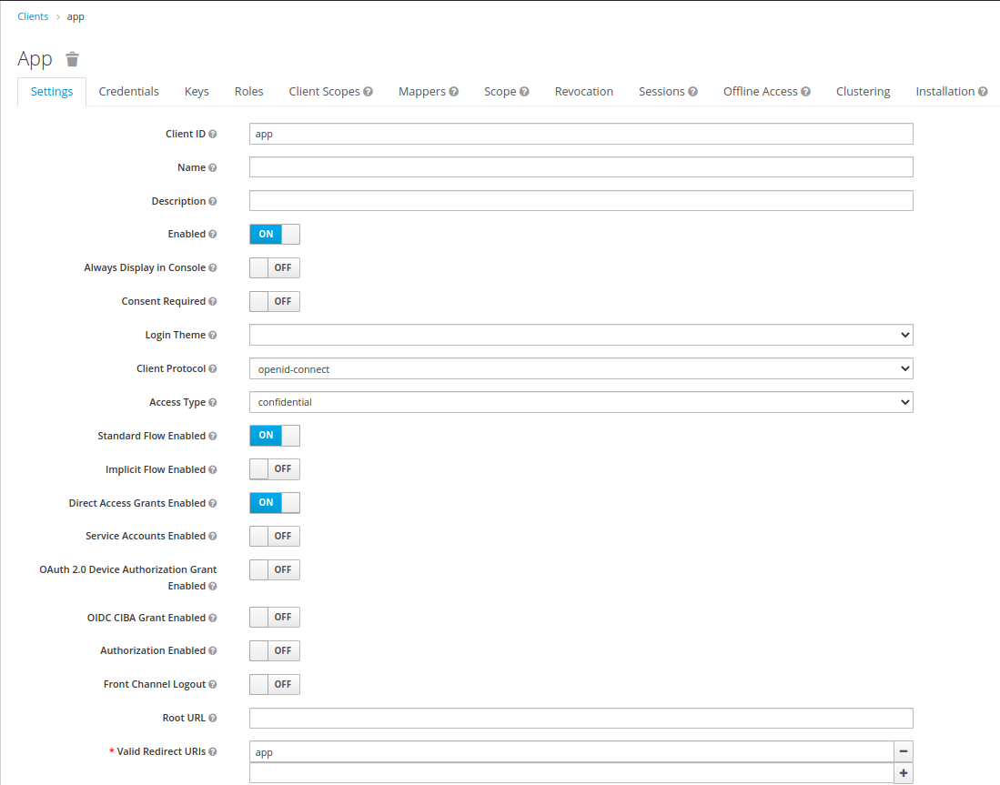
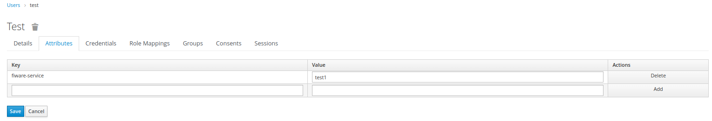
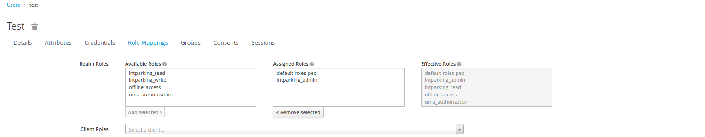
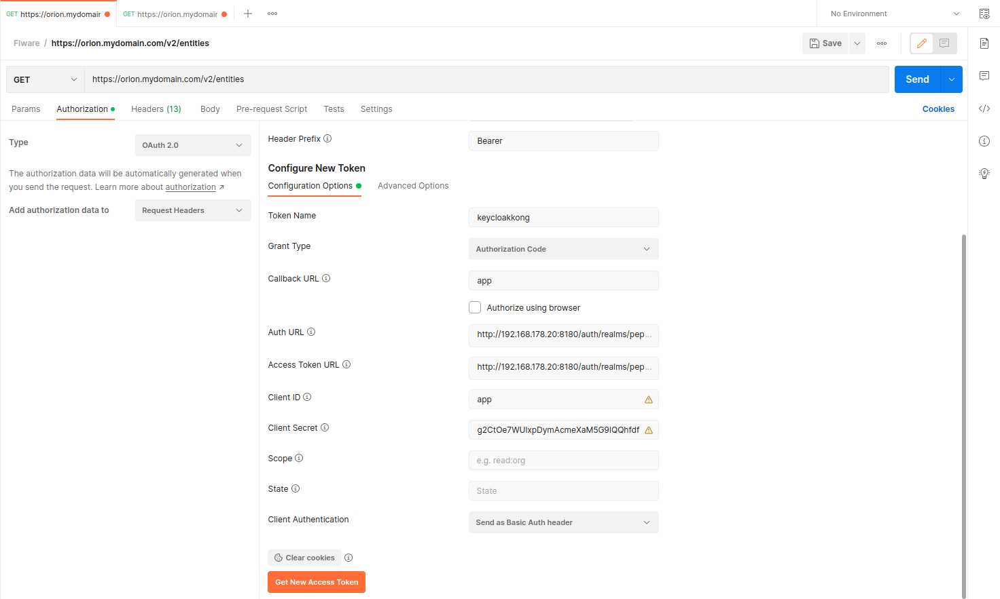

# API protection with Kong API Gateway and Keycloak integration 

This repo shows how to protect your APIs using the Kong API Gateway working as PEP proxy with a Keycloak integration for authentication and authorization of incoming requests.

- [API protection with Kong API Gateway and Keycloak integration](#api-protection-with-kong-api-gateway-and-keycloak-integration)
  - [1. Install](#1-install)
  - [2. Setup](#2-setup)
  - [3. Kong/Konga Configurations](#3-kongkonga-configurations)
    - [3.1 Creation of a Service](#31-creation-of-a-service)
    - [3.2 Creation of Routes](#32-creation-of-routes)
    - [3.3 Open ID Connect (oidc) plugin for authentication with Keycloak](#33-open-id-connect-oidc-plugin-for-authentication-with-keycloak)
    - [3.4 Configure custom plugins](#34-configure-custom-plugins)
      - [3.4.1 Configuring Multi-Tenancy Plugin](#341-configuring-multi-tenancy-plugin)
      - [3.4.2 Configuring RBAC Plugin](#342-configuring-rbac-plugin)
      - [3.4.3 Configuring scope-checker Plugin](#343-configuring-scope-checker-plugin)
      - [3.4.4 Configuring Query-Checker plugin](#344-configuring-query-checker-plugin)
  - [4. Keycloak Configurations](#4-keycloak-configurations)
  - [Testing](#testing)
  - [Docs](#docs)


## 1. Install 

The source code of all plugins must be in the respective folder, meaning:
1. luaplugins : This folder contains plugins written in lua language. Currently, the plugin "multi-tenancy" which validates for the _fiware-service header_ in the request against the one in the presented auth token, and the plugin "rbac" which supports _role based access control_ for upstream services are included. The "query-checker" plugin is included - yet, it's still in development. Plugins written in lua language provide the advantage of configuration via a GUI using Konga. Konga is a web GUI for the kong proxy. 
2. plugins : You can create your own plugins written in JavaScript here.

To use kong, we need to build an image using docker. Simply 1) clone this repo and navigate towards the kong folder and 2) use the command:
```
docker-compose build kong
```

## 2. Setup 

If kong is run for the first time, it is necessary to perform Database migration using the below commands:
```
docker-compose up -d kong-db
docker-compose run --rm kong kong migrations bootstrap
docker-compose run --rm kong kong migrations up (for upgrading from previous version)
```
Once the data migrations is performed , you can start the remaining services.
```
docker-compose up -d kong 
docker-compose up -d konga
```
Make sure all the services are up and running.

*Note* : If it is not the first time starting kong and kong-db services , you can clone and run `docker-compose up -d ` directly. 

## 3. Kong/Konga Configurations
All the configurations below are done using Konga GUI. After the inital setup, create an admin account in Konga GUI which can be accessed at `http://<machine-ip>:1337` 

### 3.1 Creation of a Service
Create a new service by clicking the Services button in the left navigation bar. Fill in the necessary details in the GUI. As a example, we create a service for the Orion Context Broker. 


*Note* : If you are deploying on a local machine it is important to use the ip address of the local machine instead of localhost due to issues with kong.

### 3.2 Creation of Routes
Creating new routes for a given service is fairly simple. Just like creating a new service, a route can be added/created for a service. So click on the Routes tab in the services page (after clicking on a service), in this example orion service. Fill in details for Paths, e.g. */v2/entities* and headers in case you need to check any particular headers. 
*Note* : fiware-service header will be checked using the multi-tenancy plugin, so there is no need to enter it here.

### 3.3 Open ID Connect (oidc) plugin for authentication with Keycloak

In this excample, a global plugin will be used in order to validate every incoming request against this plugin. In this case, every request needs to be authenticated against a Keycloak server.

1. Click on the 'Plugins' tab in the main navigation bar on the left side.
2. Click on 'ADD GLOBAL PLUGINS'.
3. Click on 'Other' and then select 'Add Plugin' option on the oidc plugin
Configure the oidc plugins as shown in the image below with the configurations as per your client. 




### 3.4 Configure custom plugins

To add any plugin, we follow the same procedure as done before with the OIDC plugin. Here, we give an example on how to add the multi-tenany plugin for the orion service. 
- Go to the orion service created in Step 3.1, click on the plugins tab on the left side under the selected service.
- Click on ADD PLUGIN option on the right side, then click on others and select multi-tenancy plugin in the option. There is no need to fill any values as the plugin matches fiware-service header to the same in the Auth Token.

#### 3.4.1 Configuring Multi-Tenancy Plugin

You can add the plugin at global, service or at route level. Select the plugin in the 'Add Plugin' section. 

`tenant name` (required) field defines the custom header name. It can be renamed as per your custom requirement. This field will be checked against the token presented in the request.


Ex: As shown in the image above, we have set the tenant name to `fiware-service`. In the incoming request to kong, it is mandatory to have a request header with name "fiware-service" and the value set in keycloak for the given user. 

*Note*: See section [4.5](#4-keycloak-configurations) for more details to configure keycloak.




#### 3.4.2 Configuring RBAC Plugin

Similar to the multi-tenancy plugin, this plugin can be used at global, service or routes level. 
When `use custom roles` is disabled, the plugin expects the role in the form *tenantname_role*. Ex: if the tenant name is set to *fiware-service:app*, then the accepted roles are `app_read`, `app_write` and `app_admin`. 

- `tenant name`(required)(String) field defines the custom header name. It can be renamed as per your custom requirement. 

- `use custom roles`(optional)(Bool) is a boolean field that decides whether to include custom roles for rbac. 

- `read role` (depends on 'use custom roles')(String) Pre-defined role needed for GET-requests.
- `write role` (depends on 'use custom roles')(String) Pre-defined role needed for PATCH, PUT, and POST requests.
- `admin role` (depends on 'use custom roles')(String) Pre-defined role needed for DELETE requests.
- `include client role` (optional)(Bool) field indicated whether to use client roles or user roles configured in Keycloak.
- `client name` (depends on include client role)(String) field is used to specify the name of the client. 
  
*Note*: See section [4.6](#4-keycloak-configurations) for more details to configure keycloak.


#### 3.4.3 Configuring scope-checker Plugin

*Note*: This plugin is intended for future use with release of oriod-ld. 
With this plugin its possible to validate the scopes sent as headers by the client against the permission given to the client in Keycloak. Make sure the headers and token attributes are set with the name as `scopes`

- `plus allowed` (Boolean) field used to decide plus(+) wildcard entries in scope
Ex: /fiware/+/temparature allows /fiware/kitchen/temparature, /fiware/room1/temparature ..
- `hash allowed` (Boolean) field used to decide hash(#) wildcard entries in scope
Ex: /fiware/kitchen/# allows /fiware/kitchen/temparature , /fiware/kitchen/pressure ..



#### 3.4.4 Configuring Query-Checker plugin
This plugin is used to authorize request path with query 

- `path` (String) speicfy the full path that has to checked. 
Ex: /v2/entities/urn:ngsi-ld:Product:010?type=Product
- `wildcard allowed` (Boolean) field used to include * wildcard as shown in fig



## 4. Keycloak Configurations

1. Create a new Realm if needed.
   1. Select the pop-up with `Add realm` option under *Master* on the left top of Keycloak admin page.
   2. Set the name of the realm, Ex: *kong* and click `create`
2. Kong client : 
   1. Create new client with client id `kong` 
   2. Under client settings, set access type to `confidential`
   3. Set service accounts `enabled`
   4. Set valid redirect uris `*` 
   5. Click on *Credentials*, use the Secret to configure kong in konga as mentioned in section [3.3](#33-keycloak-configs-for-kong)

   
3. App Client:
   1. Create new client with client id `app`
   2. Under client settings, set access type to `public` or `confidential`
   3. Set valid redirect uris `app`
   
   
4. Create a user in keycloak to get token using client id `app`
5. To support *multi-tenancy* plugin, it is necessary to have tenant name in token:
   1. Click on *Clients* on the left navigation bar
   2. Click *Mappers* under Clients and *create*
   3. Set the *Name,User Attribute and Token Claim Name* as to *tenant name*, Ex: `fiware-service` and save
   4. Use the other follwing settings as shown in the image below.
   
   5. Now go to *Users* in the left navigation bar,*view all users* and select the user.
   6. Click on *Attributes* and configure for fiware service as shown below.
   
   7. The attributes can be multivalued with format *attr1##attr2* Ex: test1##test2
6. To support *RBAC* plugin, it is necessary to configure roles in keycloak:
   1. Go to *Roles* in the left navigation bar, select *Add Role*.
   2. Set the name in the form `tenantname_role`, ex: `test1_read` and save.
   3. Go to Users and select the user to set roles.
   4. Select *Role Mapping* under given user and select the roles to be added under *Available Roles* and click *Add selected*.
   
   5. You can also create `client roles` under *Clients* and then select *Roles*, create new role using *Add Role*
   6. Now under a given user, select *Role Mapping*, choose the client under *Client Roles* and add avaiable roles
   

## Testing

After following the above steps, you can test the funcionalities of kong and its plugins using any rest client, e.g. postman or insomnia.

- Get a token from keycloak after creating a user.
- Use the Authorization header to fill the above recieved token in the format 'Bearer <*token*>'
- Add necessary headers depending on the plugins in the request and make sure it is put in the user token.
- Send the request and verify.

*Ex*: To use postman for testing, please check the image below to configure token.



## Docs

- kong-docs-url: https://docs.konghq.com/
- kong-js-plugins: https://github.com/Kong/docker-kong-js-pdk
- oidc-plugin: https://github.com/nokia/kong-oidc
