# API Protection with Kong and Keycloak for the N5GEH Platform

This repository contains the **API protection framework** for the N5GEH
platform. It shows how to protect the platform's northbound REST APIs (Orion
Context Broker, IoT-Agent, QuantumLeap) using **Kong** as an API gateway / PEP
proxy with **Keycloak** for authentication and authorization.

The framework enforces:

- **OpenID Connect (OIDC)** authentication against Keycloak.
- **Multi-tenancy** (the `fiware-service` header must match the tenant encoded
  in the JWT).
- **Role-Based Access Control** (the HTTP method must match the caller's role).
- **TLS** termination at the gateway and **rate limiting** to mitigate abuse.

- [API Protection with Kong and Keycloak for the N5GEH Platform](#api-protection-with-kong-and-keycloak-for-the-n5geh-platform)
  - [1. Security framework](#1-security-framework)
    - [1.1 Identity and Access Management](#11-identity-and-access-management)
    - [1.2 API gateway and policy enforcement](#12-api-gateway-and-policy-enforcement)
  - [2. Repository structure](#2-repository-structure)
  - [3. Prerequisites](#3-prerequisites)
  - [4. Setup](#4-setup)
    - [4.1 Configure the environment](#41-configure-the-environment)
    - [4.2 Generate certificates](#42-generate-certificates)
    - [4.3 Create the shared network](#43-create-the-shared-network)
    - [4.4 Build the Kong image](#44-build-the-kong-image)
    - [4.5 Start the platform](#45-start-the-platform)
    - [4.6 Start the API protection framework](#46-start-the-api-protection-framework)
    - [4.7 Keycloak realm import](#47-keycloak-realm-import)
    - [4.8 Kong declarative configuration](#48-kong-declarative-configuration)
    - [4.9 TLS / HTTPS introspection](#49-tls--https-introspection)
  - [5. Testing](#5-testing)
  - [6. Manual Kong / Keycloak configuration (fallback)](#6-manual-kong--keycloak-configuration-fallback)
    - [6.1 Konga connection](#61-konga-connection)
    - [6.2 Custom plugins](#62-custom-plugins)
    - [6.3 Keycloak (GUI)](#63-keycloak-gui)
  - [7. Custom Kong plugins](#7-custom-kong-plugins)
  - [8. Open tasks](#8-open-tasks)
  - [9. Docs](#9-docs)

---

## 1. Security framework

The complete LaTeX description of the security framework is available in
[`security_framework.tex`](security_framework.tex); the figures referenced below
live in [`Security_Framework/`](Security_Framework/). The previous framework
relied on the deprecated *louketo* proxies and a lightweight *traefik* reverse
proxy. The current framework replaces both with a single **Kong** API gateway
and an **EMQX** broker, adding multi-tenant support and role-based access
control.

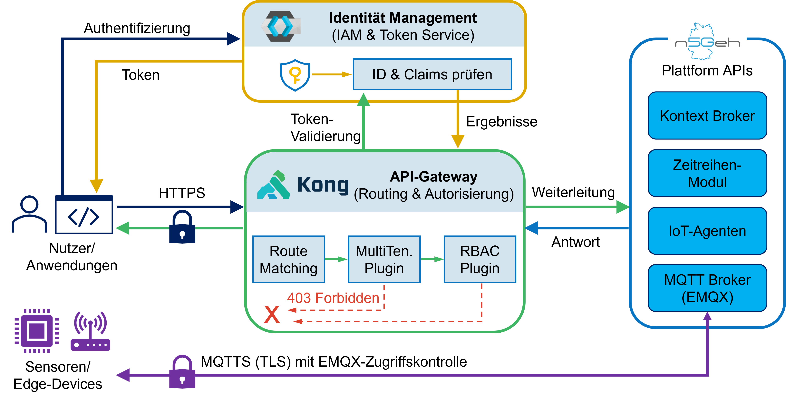

### 1.1 Identity and Access Management

Authentication is delegated to **Keycloak**, which handles user registration,
credential validation and the issuance of JSON Web Tokens (JWTs). The JWT
encodes the user's identity, assigned roles and tenant membership.

The user-management model consists of three components (see
[`keycloak_structure.drawio`](Security_Framework/keycloak_structure.drawio)):

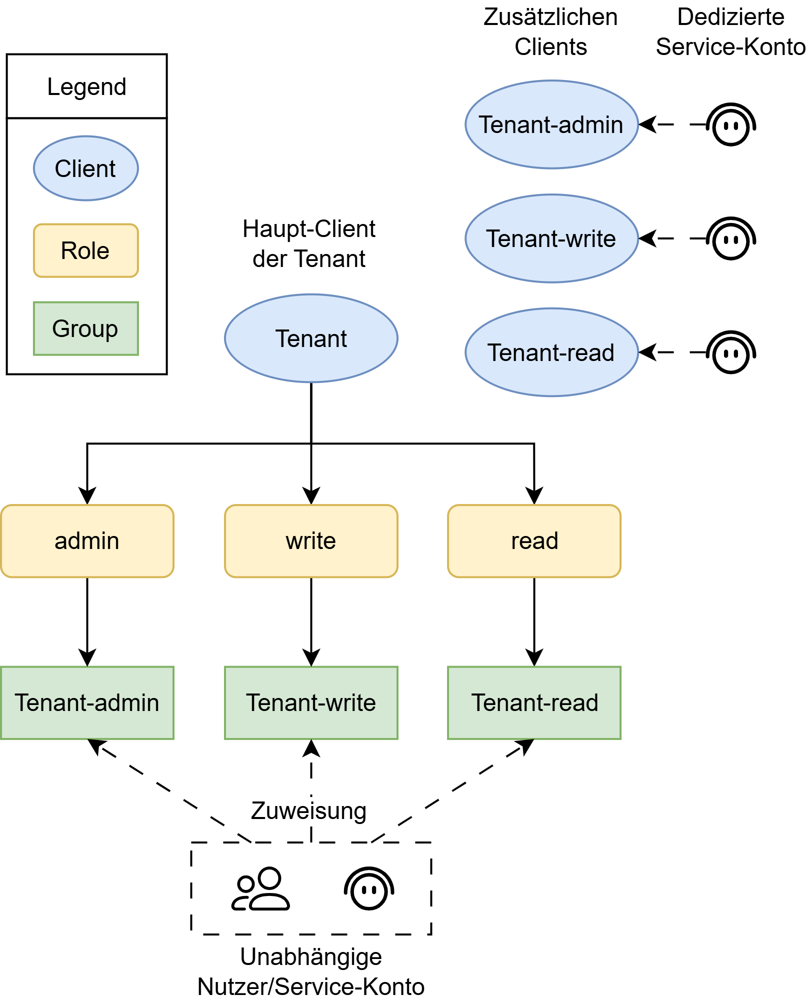

1. **Primary clients** represent the tenants (the individual FIWARE services).
   Each tenant has one primary client (e.g. `ebcdev1`) with three composite
   roles: `read`, `write` and `admin` (`write` includes `read`, `admin`
   includes `write`).
2. **Auxiliary clients** (`ebcdev1-read`, `ebcdev1-write`, `ebcdev1-admin`)
   provide isolated service-account credentials for machine-to-machine
   integration at an exact access level.

   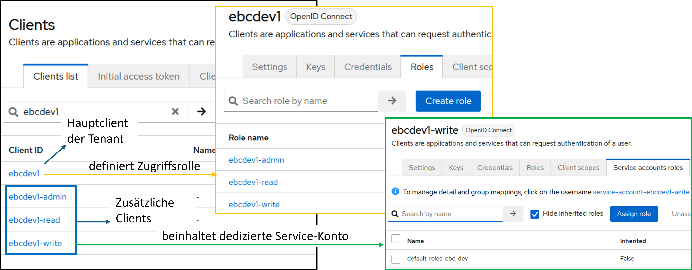
3. **Hierarchical groups** — a root `FIWARE` group, a subgroup per tenant
   tagged with the `fiware-service` attribute, and `read`/`write`/`admin`
   subgroups mapped to the composite roles.

   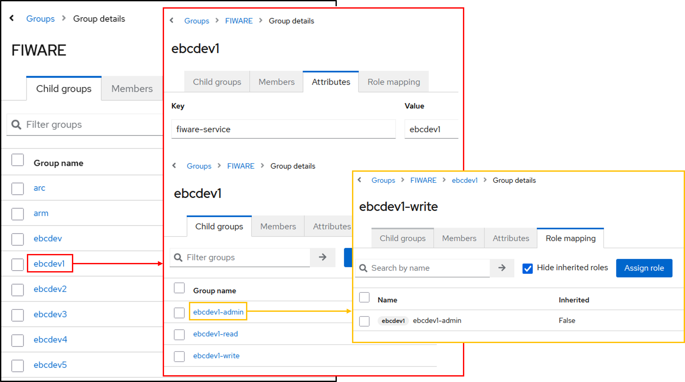

### 1.2 API gateway and policy enforcement

All northbound REST APIs are fronted by **Kong**, which enforces policies
through a chain of plugins:

- **Multi-tenant validation** — a custom plugin checks the `fiware-service`
  header against the tenant encoded in the JWT and rejects mismatches with
  `403`.
- **Role-based access control** — a second plugin compares the HTTP method
  against the caller's role (`read` for `GET`, `write` for
  `POST`/`PUT`/`PATCH`, `admin` for `DELETE`).
- **TLS encryption** — external HTTP is terminated at the gateway; unencrypted
  requests are rejected. MQTT is secured natively by the EMQX broker.
- **Authentication logging** — Kong logs all authentication and authorization
  events for auditability.
- **Rate limiting** — the official `rate-limiting` plugin caps throughput at
  `50` req/s, `1,200` req/min and `50,000` req/h.

---

## 2. Repository structure

```
├── api_protection.yaml          # API protection framework stack (Kong, Keycloak, Konga)
├── platform_v2.yaml             # N5GEH platform stack (Orion, Mongo, IoT-Agent, EMQX, QuantumLeap, Crate, Grafana)
├── .env.example                 # documented environment variables (copy to .env)
├── Dockerfile                   # Kong image with the custom Lua plugins
├── config/
│   └── kong.yml                 # Kong declarative configuration (services, routes, plugins)
├── keycloak/
│   └── realm/
│       └── kong-realm.json      # Keycloak realm imported on startup
├── luaplugins/                  # custom Lua plugins (oidc, multi-tenancy, rbac, scope-checker, query-checker)
├── scripts/
│   └── generate-certs.sh        # generates the self-signed certificates
├── tests/                       # pytest suite that verifies the setup
└── Security_Framework/          # figures + LaTeX source describing the framework
```

---

## 3. Prerequisites

- Docker (with the Compose plugin, `docker compose`) and `docker buildx`
- `openssl` (to generate certificates)
- Python 3.8+ (to run the tests)

---

## 4. Setup

### 4.1 Configure the environment

```bash
cp .env.example .env
# edit .env and set KEYCLOAK_HOSTNAME to the IP/hostname of your machine
```

Every value in `api_protection.yaml` and `platform_v2.yaml` falls back to a
sensible default; `.env` only needs to contain the values you want to change.
See [`.env.example`](.env.example) for the most important variables (the
remaining ones are defined with `${VAR:-default}` inline in the compose files).

### 4.2 Generate certificates

The compose files mount certificates for Kong, Keycloak and EMQX. Generate a
local self-signed CA and the service certificates with:

```bash
./scripts/generate-certs.sh
```

> **TODO(security):** the generated CA is self-signed and intended for local
> development only. Replace `certs/rootCA.pem` and the leaf certificates with a
> trusted CA for production.

### 4.3 Create the shared network

Both stacks share an external Docker network so that Kong can reach Orion,
IoT-Agent and QuantumLeap:

```bash
docker network create shared-n5geh-net
```

### 4.4 Build the Kong image

```bash
docker compose -f api_protection.yaml build kong
```

### 4.5 Start the platform

```bash
docker compose -f platform_v2.yaml up -d
```

### 4.6 Start the API protection framework

Start the databases first and run the Kong migration once:

```bash
docker compose -f api_protection.yaml up -d kong-db keycloak-db
docker compose -f api_protection.yaml run --rm kong kong migrations bootstrap
```

Then start the remaining services:

```bash
docker compose -f api_protection.yaml up -d
```

Wait for all services to be healthy:

```bash
docker compose -f api_protection.yaml ps
docker compose -f platform_v2.yaml ps
```

> **Note:** on subsequent runs (databases already migrated), a plain
> `docker compose -f platform_v2.yaml -f api_protection.yaml up -d` is enough.

### 4.7 Keycloak realm import

The Keycloak container automatically imports
[`keycloak/realm/kong-realm.json`](keycloak/realm/kong-realm.json) on first
startup (via `--import-realm`). It provisions:

- realm `kong`;
- client `kong` (confidential, secret `kong-client-secret`) used by the OIDC
  plugin;
- client `app` (public) for end-user applications;
- tenant client `ebcdev1` with composite roles `read`/`write`/`admin` and the
  auxiliary service-account clients `ebcdev1-read`/`-write`/`-admin`;
- the `FIWARE` → `ebcdev1` → `ebcdev1-read`/`ebcdev1-write`/`ebcdev1-admin` group hierarchy;
- a demo user `testuser` (password `testpassword`) in the `ebcdev1-read`
  group with the `fiware-service=ebcdev1` attribute.

The Keycloak admin console is available at
`https://<KEYCLOAK_HOSTNAME>:<KEYCLOAK_HTTPS_PORT>` (e.g., `https://example.com:8543`).
User/password from `.env`, default `admin`/`admin`.

### 4.8 Kong configuration

Load Kong configuration ([`config/kong.yml`](config/kong.yml)) with `db-import`:

````bash
docker exec -it kong kong config db_import /etc/kong/declarative/kong.yml
````

After the import, Kong automatically reloads the configuration and needs to be restarted to apply the changes:

```bash
docker restart kong
```

This configures:
- the `oidc` **global** plugin (authenticates every request via Keycloak
  introspection);
- the global `rate-limiting` plugin;
- services + routes for Orion (`/orion`), IoT-Agent (`/iot`) and QuantumLeap
  (`/quantumleap`), each with the `multi-tenancy` and `rbac` plugins.

> **Note:** the OIDC `client_secret` in `config/kong.yml` must match the `kong`
> client secret in `keycloak/realm/kong-realm.json` (`kong-client-secret`).

You can verify the configuration via Konga UI, available at `http://<IP>:1337`.
Follow the [Konga instruction](#61-konga-connection) for more details.

### 4.9 TLS / HTTPS introspection

When the OIDC plugin introspects tokens against an **HTTPS** Keycloak endpoint,
Kong verifies the Keycloak server certificate. The trust anchor for this
verification is `KONG_LUA_SSL_TRUSTED_CERTIFICATE` (set to
`/etc/kong/certs/rootCA.pem` in `api_protection.yaml`).

This works end-to-end: Kong turns `KONG_LUA_SSL_TRUSTED_CERTIFICATE` into the
nginx `lua_ssl_trusted_certificate` directive, which the OIDC plugin's HTTP
client (`lua-resty-openidc` → `lua-resty-http`) uses during the TLS handshake
of the introspection call. So the plugin **does** honor that setting.

If you see the error

```
accessing introspection endpoint (...) failed:
21: unable to verify the first certificate
```

it means the certificate served by Keycloak is not signed by the CA that Kong
trusts. Typical causes and fixes:

1. **Kong was started before the env var / certs existed.** Recreate the Kong
   container so Kong regenerates its nginx config and combined trust store:
   ```bash
   docker compose -f api_protection.yaml up -d --force-recreate kong
   ```
2. **The served certificate is not signed by `certs/rootCA.pem`.** Regenerate
   the certificates and check they match:
   ```bash
   ./scripts/generate-certs.sh
   ./scripts/check-tls.sh <KEYCLOAK_HOSTNAME> <KEYCLOAK_HTTPS_PORT>
   ```
3. **The certificate chain has intermediates beyond the verification depth.**
   Raise `KONG_LUA_SSL_VERIFY_DEPTH` in `.env` (default `5`).
4. **Development fallback (insecure).** Disable verification by setting
   `ssl_verify: "no"` on the `oidc` plugin in `config/kong.yml`. Do not use
   this in production.

Use `./scripts/check-tls.sh` to diagnose which of the above applies.

---

## 5. Testing

The pytest suite verifies that the platform and the API protection framework
are set up correctly:

```bash
pip install -r tests/requirements.txt
pytest tests/ -v
```

> **Note:** if you run the tests from a different machine than the one hosting the platform,
> you must create a `.env` file as well. Set the `KONG_PROXY_URL` and `KEYCLOAK_URL` environment 
> variables to the correct hostnames.


The suite checks that:

1. the Kong admin API and Keycloak are reachable;
2. Keycloak issues a JWT encoding the `fiware-service` tenant;
3. Kong rejects requests **without** a token (`401`);
4. Kong allows requests **with** a valid token and matching tenant (`200`);
5. Kong rejects a mismatched `fiware-service` header (`403`);
6. Kong rejects a write (`POST`) performed with a read-only token (`403`).

The test endpoints can be overridden via `.env` (`KONG_ADMIN_URL`,
`KONG_PROXY_URL`, `KEYCLOAK_URL`, `TEST_TENANT`, ...).

---

## 6. Manual Kong / Keycloak configuration (fallback)

The declarative configuration and realm import automate most of the setup. The
steps below describe how to configure everything manually through the GUIs, in
case you prefer that approach.

### 6.1 Konga connection

Konga is available at `http://<YourIP>:1337`. On first start, create an admin
account and connect Konga to Kong's admin API at `http://kong:8001`.


### 6.2 Custom plugins

The plugins are configured as global/service/route plugins. The `oidc` plugin
must always be combined with the other plugins to ensure token validity.

- **OIDC** — validate every request against Keycloak.

  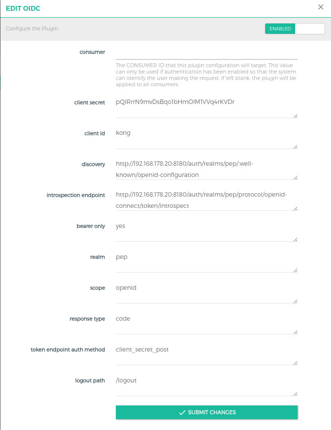
- **Multi-Tenancy** — `tenant name` defines the custom header (default
  `fiware-service`) checked against the token.

  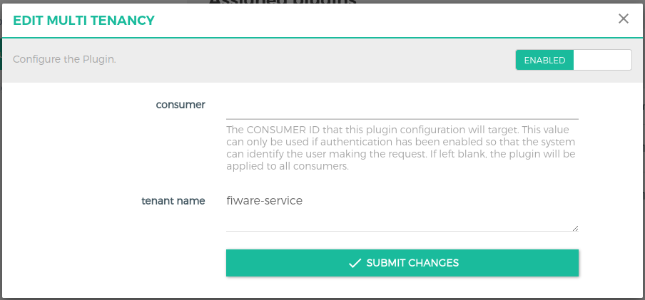
- **RBAC** — maps HTTP methods to roles. With `use custom roles` disabled the
  plugin expects roles of the form `<tenant>_<role>` (e.g. `ebcdev1_read`). The
  realm import uses custom roles + client roles instead.

  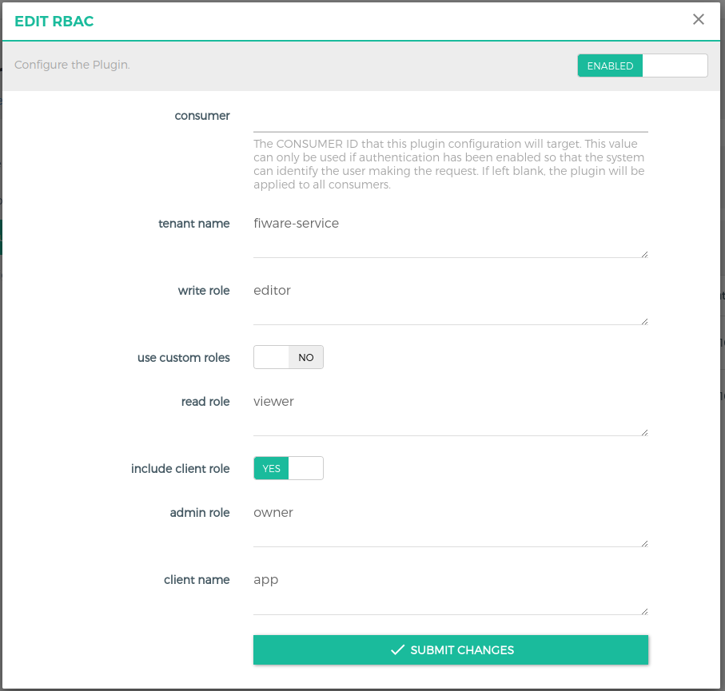
- **scope-checker** — validates `scopes` headers (intended for Orion-LD).

  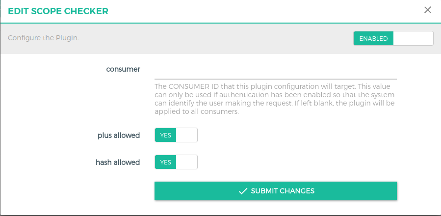
- **query-checker** — authorizes request paths with queries.

  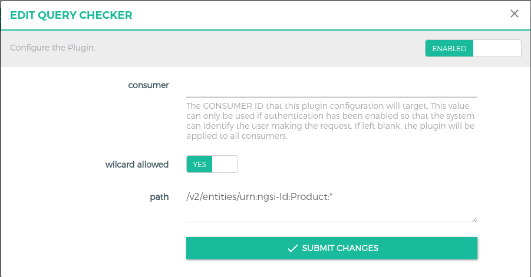

### 6.3 Keycloak (GUI)

See the images below for the manual realm configuration (realm, `kong` client,
`app` client, `fiware-service` mapper, roles and user attributes):

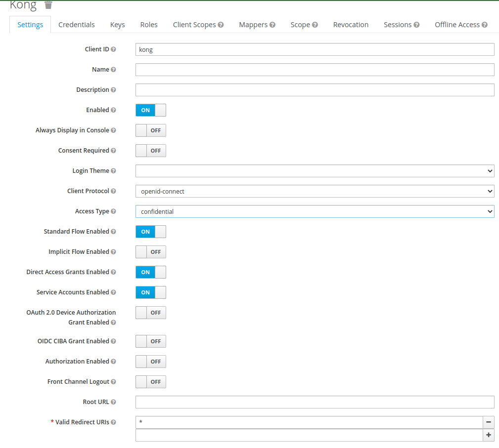
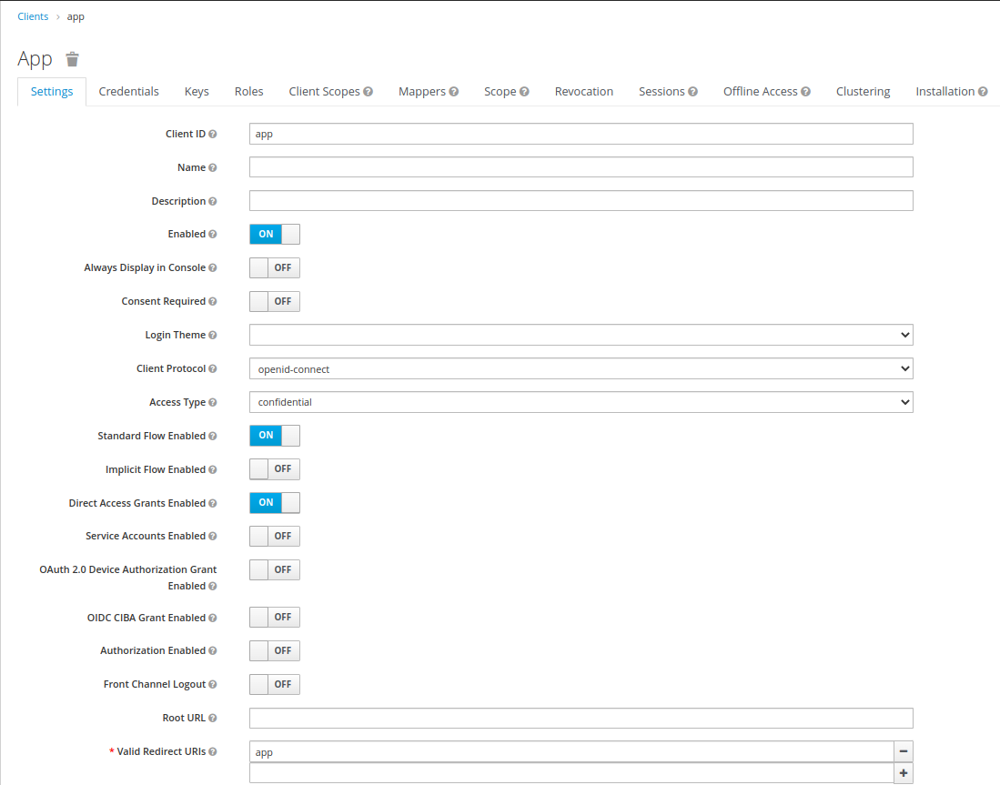
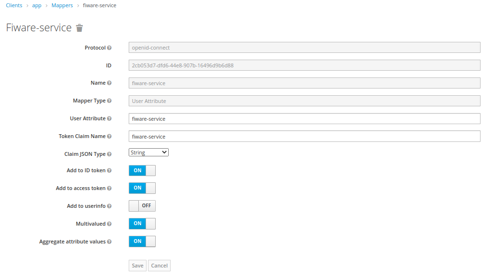
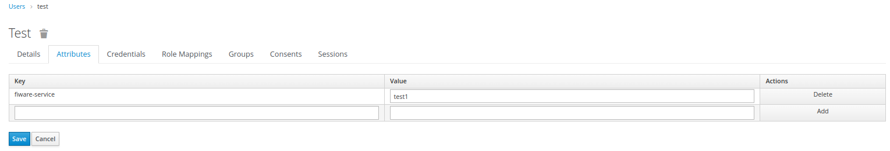
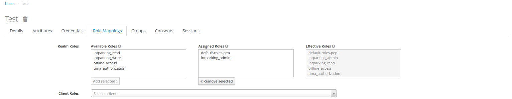

---

## 7. Custom Kong plugins

| Plugin           | Purpose                                                        |
|------------------|----------------------------------------------------------------|
| `oidc`           | OpenID Connect authentication / introspection against Keycloak |
| `multi-tenancy`  | Validates the `fiware-service` header against the JWT          |
| `rbac`           | Role-based access control based on HTTP method + role          |
| `scope-checker`  | Validates `scopes` headers (future Orion-LD use)               |
| `query-checker`  | Authorizes request paths containing a query                    |

The plugins live in [`luaplugins/`](luaplugins/) and are installed into the Kong
image by the [`Dockerfile`](Dockerfile).

---

## 8. Open tasks

- [ ] **Production certificates** — the self-signed CA generated by
      `scripts/generate-certs.sh` must be replaced with a trusted CA (see the
      `TODO(security)` markers).
- [ ] **Automated Keycloak/Kong provisioning** — the realm import and
      declarative Kong config cover the happy path. Fully automated
      provisioning via the Keycloak/Kong admin APIs (e.g. creating arbitrary
      tenants) is not yet implemented.
- [ ] **Multi-tenant RBAC** — `config/kong.yml` configures the `rbac` plugin
      with `client_name: ebcdev1`. For additional tenants the plugin has to be
      configured per tenant; deriving the client name from the token's tenant
      would remove this limitation.
- [ ] **`fiware-service` token claim format** — the multi-tenancy plugin expects
      the claim as a JSON array; verify the Keycloak mapper emits an array for
      single-valued attributes.

---

## 9. Docs

- Kong: <https://docs.konghq.com/>
- OIDC plugin (fork): <https://github.com/nokia/kong-oidc>
- Keycloak: <https://www.keycloak.org/documentation>
- FIWARE: <https://www.fiware.org/developers/catalogue/>
